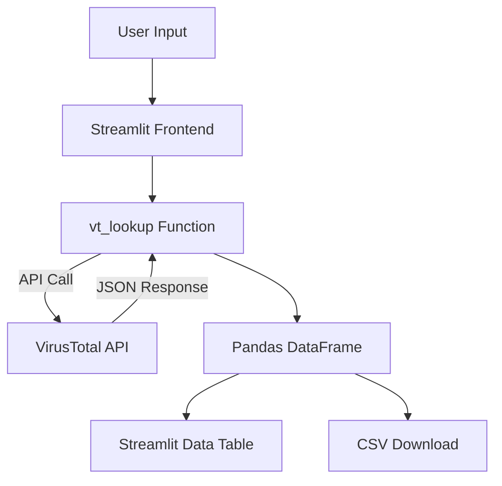

## Overview

This application provides a user-friendly Streamlit interface to interact with the **VirusTtoal API**. It allows users to input a list of **IP addresses**, **domain names**, or **file hashes**, scan them using VirusTotal, and retrieve threat intelligence metrics. Results can be viewed in a table and exported as a CSV file.

## Architecture Components
### 1. Frontend: Streamlit Interface
  - **Title**: Sets the page title with an emoji
  - **Query Type Selector**: Dropdown (selectbox) to choose between "IP", "Domain" or "File Hash"
  - **Input Area**: A `text_area` to enter multiple input values (one per line)
  - **Scan Button**: Triggers the scanning process
  - **Results Table**: Displays results in a Streamlit `dataframe`
  - **CSV Download**: Offers results as a downloadable CSV file

 ### 2. Backend: VirusTotal Lookup Function  
 `def vt_lookup(query, type="ip"):

  - **Parameters**:
    - query: the IP/domain/hash to be scanned
    - type: the type of the query (`ip`,`domain`, or `file`)
  - **Endpoint Builder**:
    - Builds the correct API URL based on the type
  - **Request**:
    - Uses `requests` to make a GET call to VirusTotal's API
    - Header includes your API key from `config.py`
  - **Response Handling**:
    - On success (200), returns relevant analysis stats
    - On error, returns a dictionary with an error message

### 3. Configuration Module: `config.py`
  - This file is expected to hold the `VIRUSTOTAL_API_KEY`

 `\# config.py`  
`VIRUSTOTAL_API_KEY = "your_api_key_here"`

## Data Flow

## Dependencies
  - `streamlit`: For building the frontend interface
  - `pandas`: For data manipulation and exporting to CSV
  - `requests`: For making HTTP requests to the VirusTotal API
  - `config`: Custom config file to store API key securely

## Key Features
  - Bulk input (multi-line text)
  - Supports scanning of:
    - IP addresses
    - Domain names
    - File hashes
  - Interactive results in a table
  - CSV download of scan results
  - Error handling for failed API requests

## Security Considerations
  - **Do NOT** harcode API key in the main script. Use `config.py`
  - Use `.gitignore` to exclude `config.py`

## Future Improvements
  - Add caching to avoid redundant API calls
  - Add progress indicators for large scans
  - Include detailed scan results
  - Add support for API rate limiting